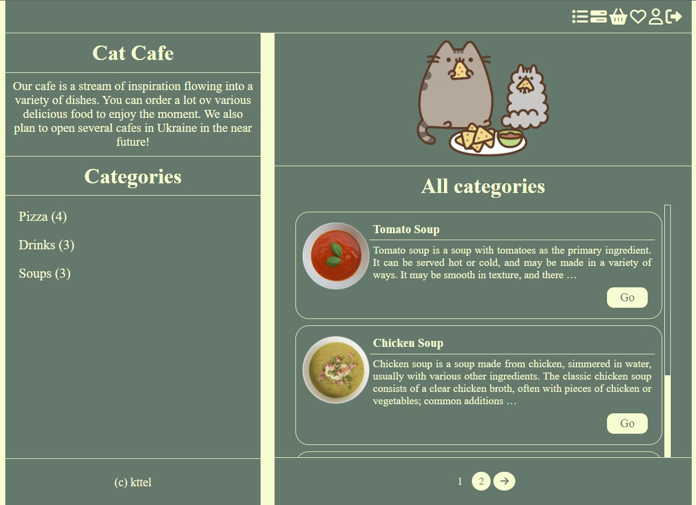
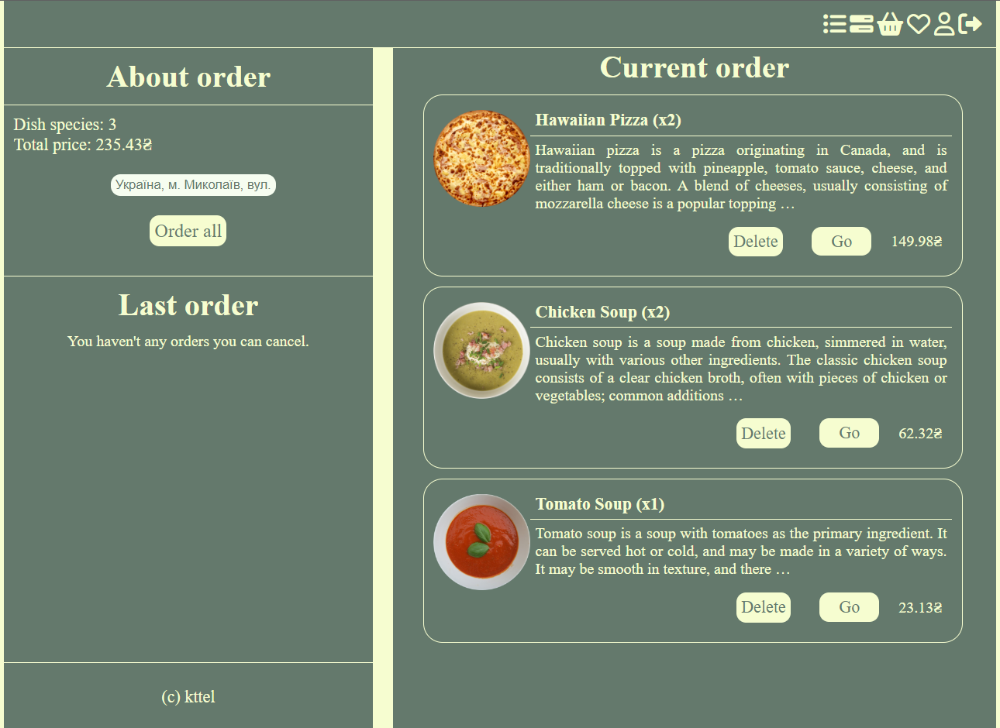
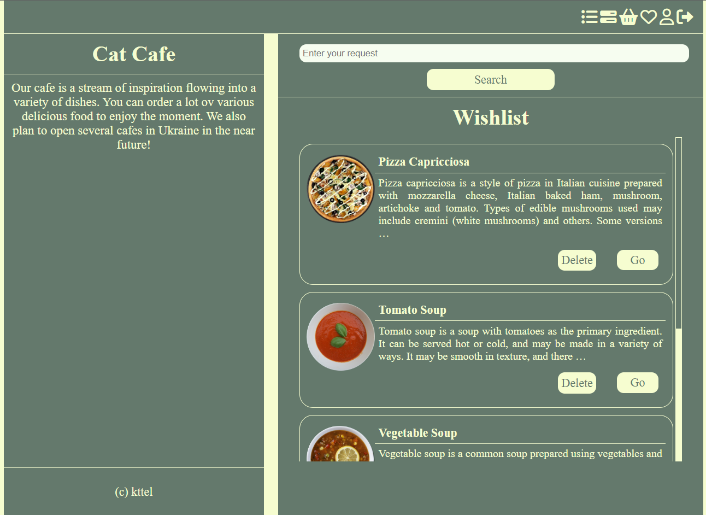
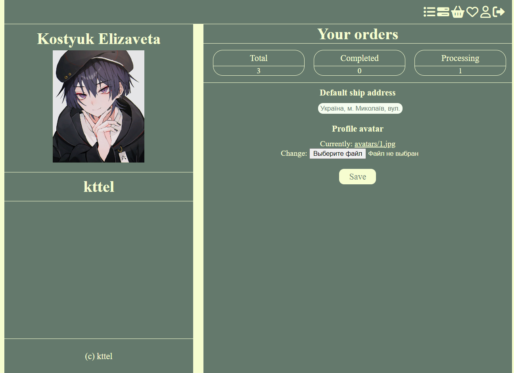
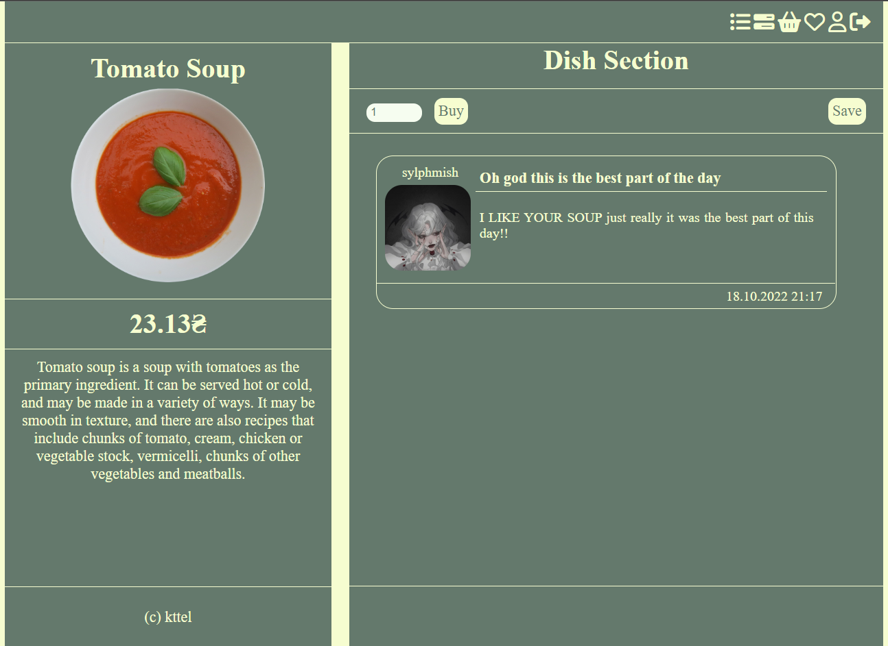

# Cat Cafe [](https://www.python.org/)

Python Django application for a simple cafe

## Features

- you can register your account using custom login and password;
- you can login into your account using your login and password;
- you can edit your profile information;
- you can add various tasks with its title, description and status;
- you can delete your created tasks;
- you can see lists with all dishes by categories;
- you can see details about dishes;
- you can add any dishes in your wishlist;
- you can order any dishes with selected amount;
- you can edit your order by adding or deleting dishes;
- you can cancel last non-finished orders;
- as cafe worker you can see all non-finishes orders and change their status.

## Steps to be followed for first time use
- run this command to clone this repository
```bash
git clone https://github.com/kttel/catcafe.git
```
- add new virtual environment in project directory and install all neccessary libraries from requirements.txt
```bash
cd catcafe

python -m venv venv

pip install -r requirements.txt
```
- go to the catcafe and create file .env with your SECRET_KEY, DB_NAME, DB_USERNAME and DB_PASSWORD constants
- in project run this commands to work with database
```bash
python manage.py makemigrations

python manage.py migrate
```
- create superuser to work with admin panel 
```
python manage.py createsuperuser
```
## Before starting
Before using this app it is highly recommended to add some information in the database (various categories, dishes et cetera).
## Usage

- in the directory with manage.py file run this command
```
python manage.py runserver
```
## Screenshots






## Contributing
Various pull requests are welcome. Project can be updated in any time.

Last update: 02.11.2022
